1. SI制中，一些常用的十进制倍数的表示法

   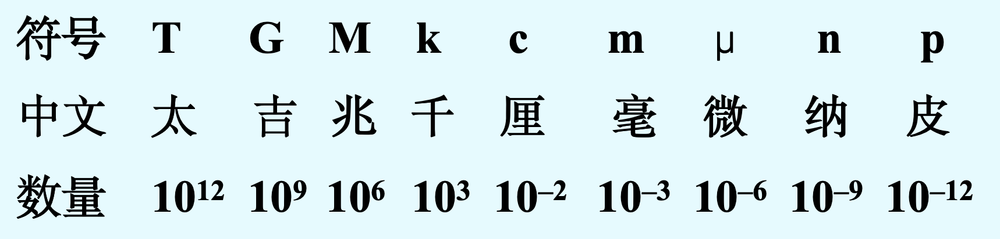

2. 电动势：外力（非静电力）克服电场力把单位正电荷从负极经电  源内部移到正极所作的功称为电源的电动势。  

3. 电导的单位：西门子（S）

4. 独立源作为电路中“激励（excitation）”，在电路中产生电压、电流，而受控源只是反映电压、电流之间的控制关系，在电路中不能作为“激励”。  

5. 一个不含独立源的二端（two-terminal）电阻网络可以用一个电阻等效。

6. 理想电压源与理想电流源不能相互转换。  

7. 对有n个节点  的电路，独立的KCL方程只有n-1个 。  

8. b条支路，n个节点的电路，有b-n+1个独立回路

9. 支路法的一般步骤（这个基本不考）

   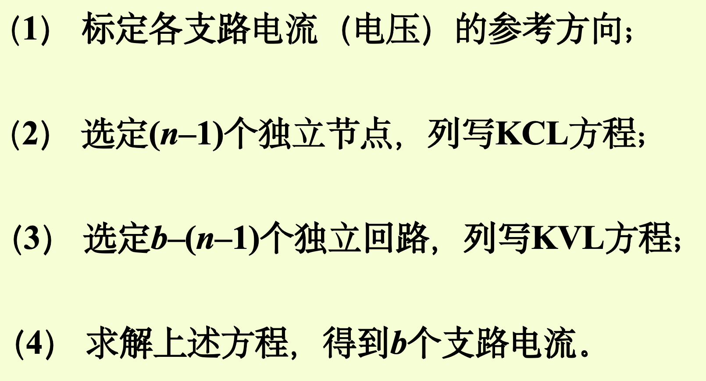

10. 比较

    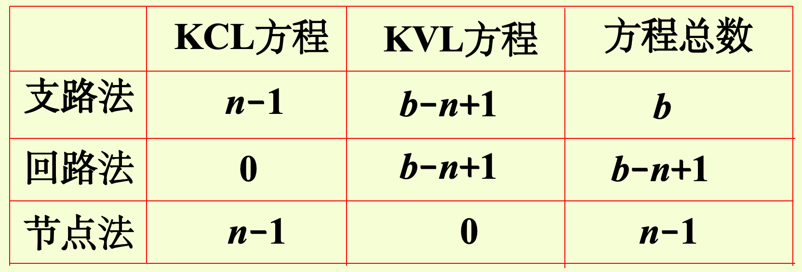

11. 叠加定理只适用于线性电路

12. 功率不能叠加（功率为电压或电流的二次函数）。

13. 含受控源（线性）电路亦可用叠加，但叠加只适用于独立源，受控源应始终保留。 

14. 替代定理既适用于线性电路，也适用于非线性电路。

15. 特勒根定理适用于一切集总参数电路。只要各支路 u、i满足KCL、KVL即可。 

16. ==理想运放==

    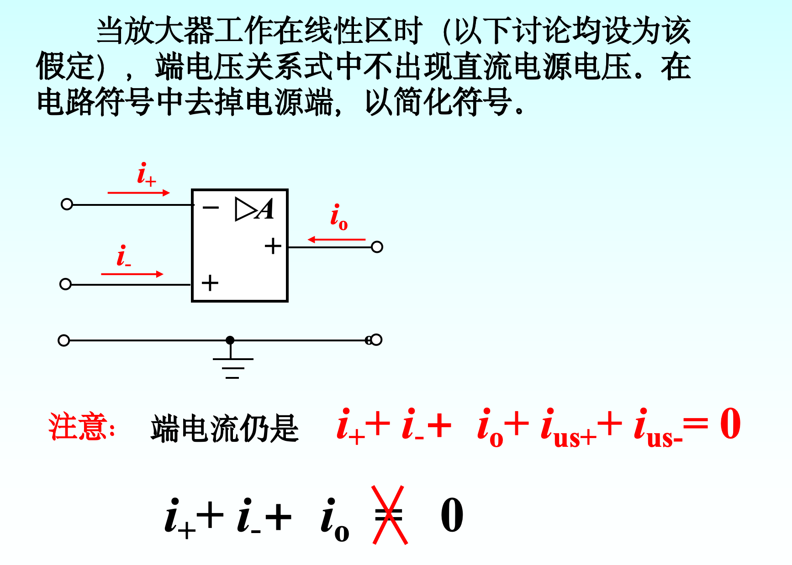

17. 运放不能工作在开环状态（极不稳定，振荡在饱和），一般工作在闭环状态，输出电压由外电路决定。  

18. 电压跟随电路

    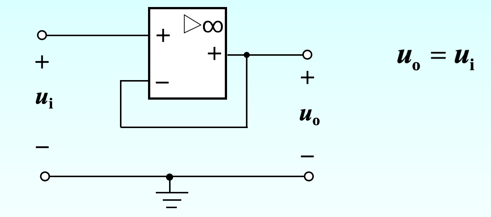

    在电路中起隔离前后两级电路的作用。  

19. 电容元件是一种记忆元件。  

20. 线性定常电容元件：任何时刻，电容元件极板上的电荷q与电压 u 成正比。  

21. 线性定常电感元件：任何时刻，电感元件的磁链$\psi$与电流 i 成正比。  ==L  称为自感系数（self inductance）==

22. 换路瞬间，若电容电流保持为有限值，则电容电压（电荷）换路前后保持不变。

23. 换路瞬间，若电感电压保持为有限值，则电感电流（磁链）换路前后保持不变。 

24. 零输入响应（==Zero-input response==）：激励（电源）为零，由初始储能引起的响应。  

25. 零状态响应（==zero-state response==）：储能元件初始能量为零，在激励（电源）作用下产生的响应。  

26. 对于换路后有稳态的情况，三要素法才适用

27. 阻尼图像（零状态响应）

    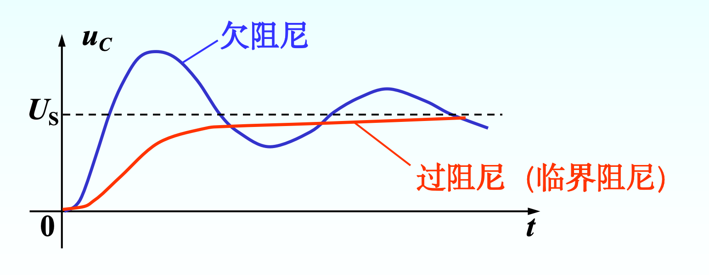

28. 卷积四步

    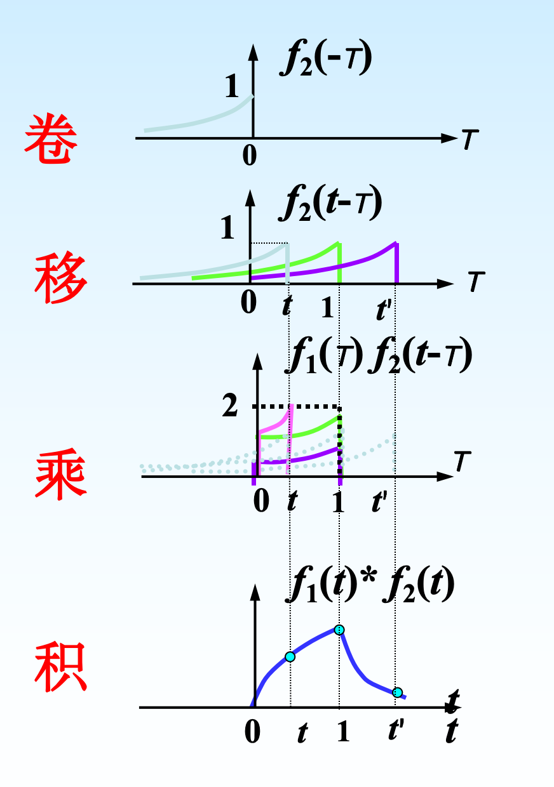

29. 在换路瞬间，若电感两端出现冲激电压时，电感中的电流可能发生跃变，此时电感的瞬时充电（或放电）功率为无穷大。

30. 正弦量三要素：幅值、角频率、初相位

31. 有效值也称方均根值

32. QL>0，电感吸收无功功率。QC<0，电容发出无功功率。

33. 功率因数低带来的问题

    （1） 设备不能充分利用；      

    （2）当输出相同的有功功率时，线路上电流I=P/(Ucosj)大，线路上功率、电压损耗大。

34. 耦合系数（coupling coefficient）k表示两个线圈磁耦合（magnetic coupling）的紧密程度。

35. 同名端是分别属于两个线圈的这样两个端点：当两个电流分别从这两个端点流入，与每个线圈相链的自感磁通同由另一线圈的电流产生的互感磁通方向相同，因而互相加强，这两个端点便是同名端。

36. 互感不大于两个自感的算术平均值。

37. 全耦合变压器电路模型

    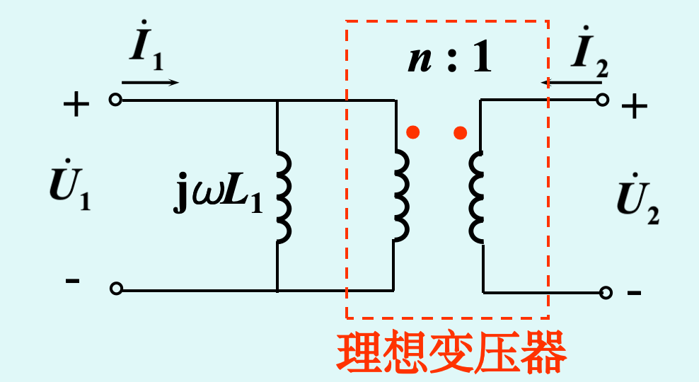

    L1—激磁电感（magnetizing inductance） 

38. 无损非全耦合变压器的电路模型

    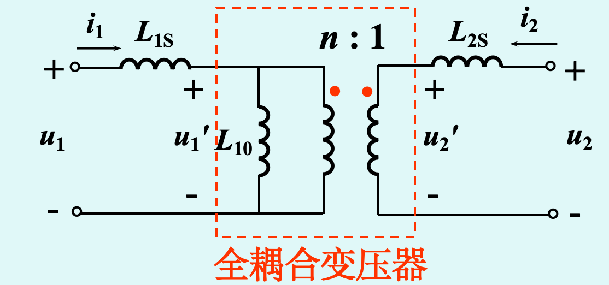

    L1S ,  L2S—漏电感（leakage inductance）

39. 考虑导线电阻（铜损）和铁心损耗的非全耦合变压器

    

    R1, R2—表示线圈导线损耗（铜损）

    L10—激磁电感。由于铁心材料的非线性， L10通常为非线性

    Rm—表示铁心损耗

40. 谐振的定义：在正弦交流稳态下，当含LC的一端口网络输入端的电压、电流同相时，则称该网络处于谐振状态（resonance state）。

41. 特性阻抗

    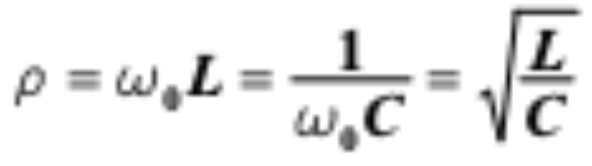

42. 品质因数

    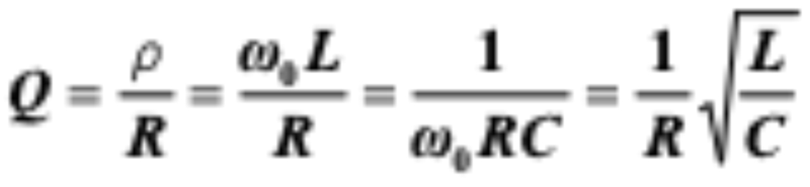

43. ==避免谐振的原因==：电力系统中，由于系统电源电压比较高，一  旦发生谐振，会因过电压而损坏设备绝缘。

44. 选择性的定义：若RLC串联电路中，有不同频率的电压源同时作用时，  则接近谐振频率w0 的电流将可能大于其它偏离谐振频率的电流而被选择出来，这种性能在无线电技术中称为“选择 性”。

45. 网络函数的分类：驱动点函数（驱动点导纳，驱动点阻抗）；转移函数（转移导纳，转移阻抗，电压转移比，电流转移比）

46. 频带 ：一个一定的频率范围。

47. 通频带（或通带）：信号可以通过一滤波器的频带。

48. 阻带：信号被阻止通过的频带。

49. 截止频率：通带与阻带交界处的频率

50. 三角形连接三相电源

    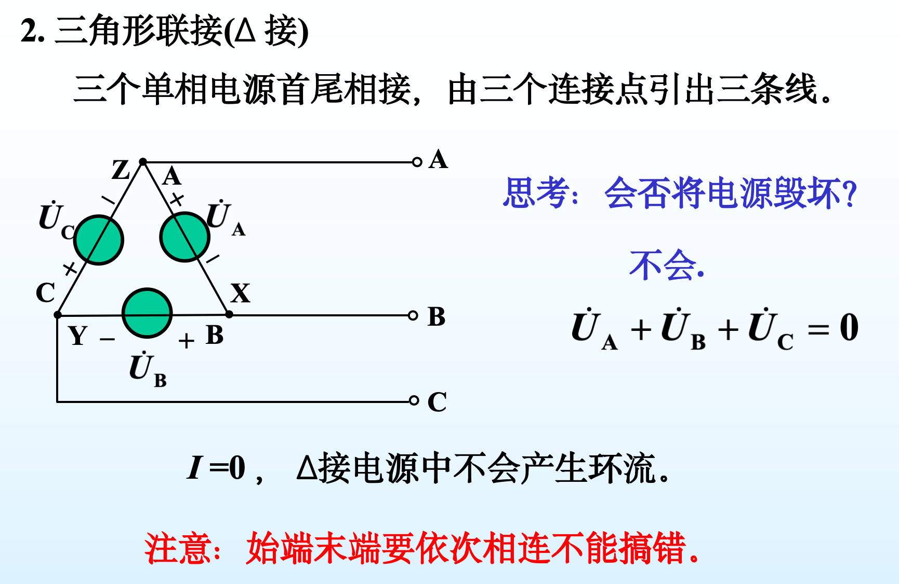

51. ==相序仪==：将相序仪三端分别接至电源三端，若设接电容一相为A相，则灯亮的为B相，灯暗的为C相。

    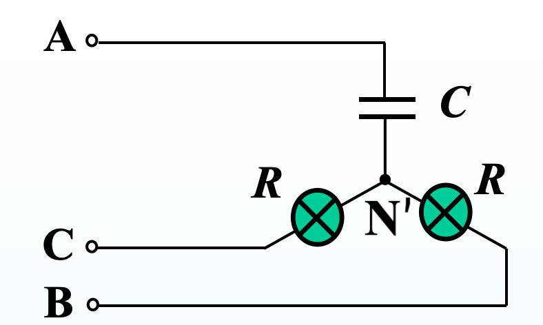

52. 两表法

    只有在 iA+iB+iC=0 这个条件下，才能用二表法。

    两块表读数的代数和为三相总功率，每块表的单独读数无意义。

    按正确极性接线时，二表中可能有一块表的读数为负。

53. 高次谐波下的三相电路各电量定性分析

    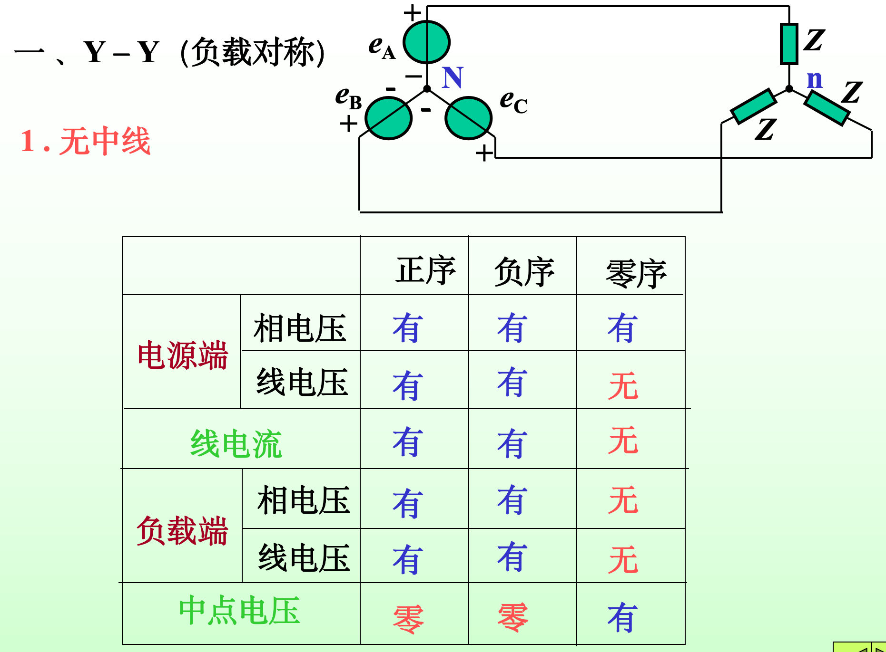

    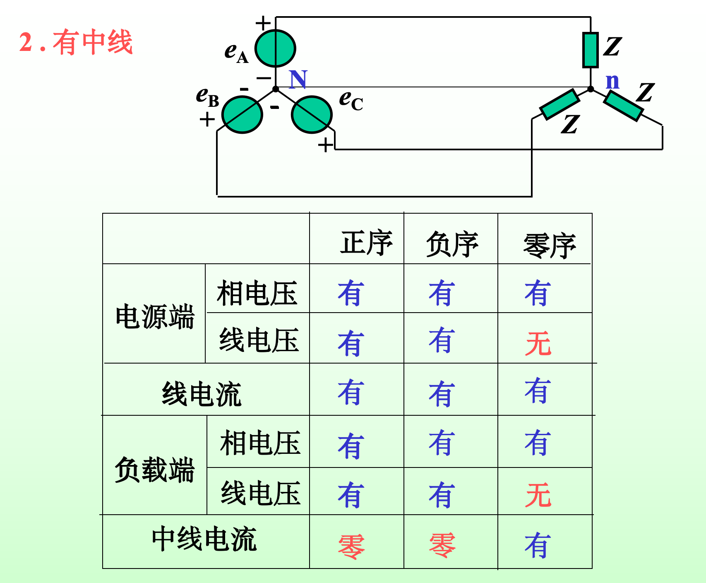

54. 二端网络和四端网络辨析

    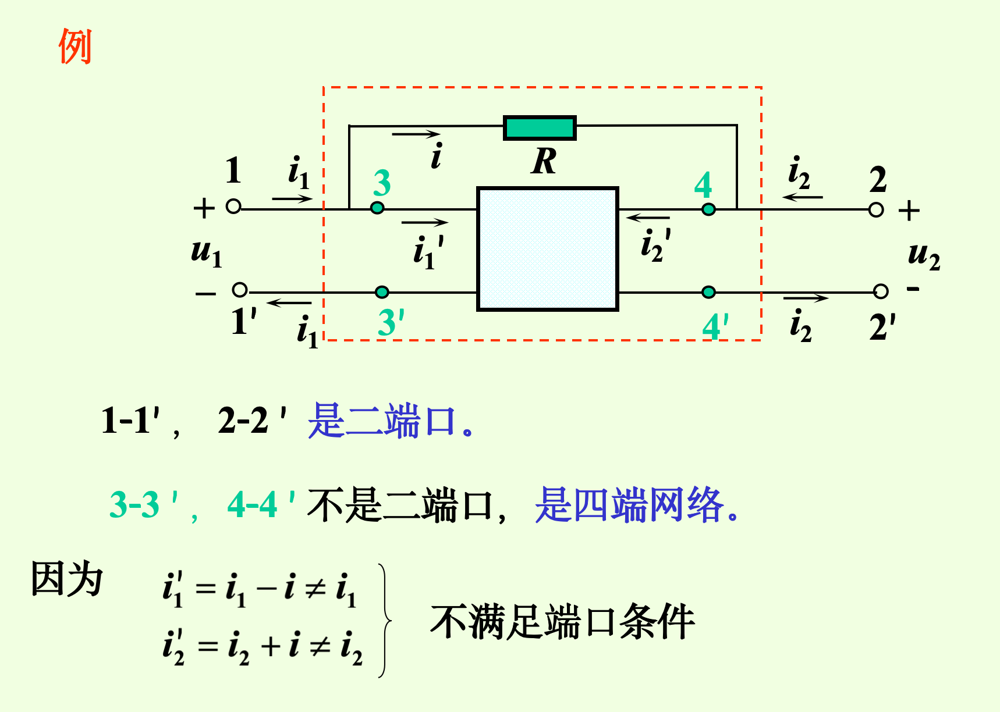

55. 对称二端口网络的特性阻抗：当ZL = ZC时，恰好使Zi = ZC，则 ZC称为二端口的特性阻抗。

56. 
